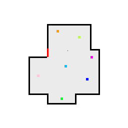
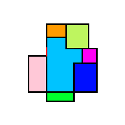

# 🧠 Generative Adversarial Network for Floor Plan Generation 🏠

A PyTorch-based project that trains a **Generative Adversarial Network (GAN)** to generate architectural floor plans from grayscale or black-and-white sketches. Designed to be lightweight and trainable on systems with limited resources (e.g., 8GB RAM and GTX 1650 GPU), this project showcases a practical application of GANs in the architectural domain.

> ⚠️ **Important Note**: This repository **does not include** the dataset, input sketches, or generated output images due to ownership constraints. Only the trained model files and core scripts are provided.

---

## 🚀 Project Highlights

- 🔁 **Paired Dataset Format**: Training was performed using paired input/output images matched by filename in separate folders.
- 🧠 **Custom GAN**: Utilizes a U-Net-style Generator and a PatchGAN-based Discriminator.
- 💾 **Pretrained Models Included**: `generator_final.pth` and `discriminator_final.pth` are ready to use.
- 🧪 **Inference-Ready**: Run `run.py` with your own input images.
- 🛠️ **Optimized Implementation**: Built for faster training and efficient resource usage.

---

## ✨ Key Features

- ✅ Fully functional GAN pipeline (training + inference)
- ✅ Lightweight and optimized for mid-tier hardware
- ✅ Pretrained models included for quick results
- ✅ Easy integration with your own datasets — just match filenames
- ✅ Clean and modular codebase with simple preprocessing

---

## 📁 Project Structure

```
project_root/
├── generator_final.pth         # Pretrained generator model
├── discriminator_final.pth     # Pretrained discriminator model
├── train.py                    # Training script
├── run.py                      # Inference script
├── app.py                      # Optional: Interface script (WIP)
├── r.txt                       # Requirements file (rename to requirements.txt)
└── README.md                   # Project overview (this file)
```

---


## 🧪 Example Workflow

### 🖼️ Input(From Dataset)
 

### 🧾 Output (From Dataset)


---

## ⚙️ Getting Started

### 1️⃣ Clone and Set Up the Repository
```bash
git clone https://github.com/varunnnnsonii/Generative-Adversarial-Network-Floor-Plan.git
cd Generative-Adversarial-Network-Floor-Plan

# Rename the requirements file if needed
mv r.txt requirements.txt

pip install -r requirements.txt
```

### 2️⃣ Train the Model (if you have a paired dataset)
```bash
python train.py
```

### 3️⃣ Generate New Floor Plans
```bash
python run.py
```

> 📝 Make sure your input image is grayscale, resized, and named appropriately to match the training format.

---

## 🧠 Model Architecture

- **Generator**: U-Net-based encoder-decoder architecture
- **Discriminator**: PatchGAN classifier — evaluates image quality in local patches for realism

---

## 📦 Requirements

- Python 3.8+
- PyTorch
- torchvision
- Pillow
- tqdm

Install with:
```bash
pip install -r requirements.txt
```

---

## 🙋 FAQ

**Q: Is the dataset included?**  
A: ❌ No, due to copyright/ownership restrictions.

**Q: Are sample input/output images available?**  
A: ❌ Not included for the same reason — feel free to use your own images.

**Q: Can I test this with my own floor plans?**  
A: ✅ Absolutely! Just follow the input format used during training.

---

## ✍️ Author

**Varun D Soni**  
🔗 [GitHub](https://github.com/varunnnnsonii)  
📫 varun271203@gmail.com

---

## 🌟 Support & Contributions

If this project helped or inspired you:

- ⭐ Star the repo
- 🍴 Fork it and build on it
- 🐛 Report issues or open PRs

---

## ✅ Final Touches

- Create your own `requirements.txt`:
  ```bash
  pip freeze > requirements.txt
  ```
- Upload your own input/output images if desired
- Replace placeholder image paths in README (optional)
- Push updates to your repo:
  ```bash
  git add .
  git commit -m "Polished README and setup 🚀"
  git push
  ```

---

Thank you for exploring this project — happy generating! 🏗️

